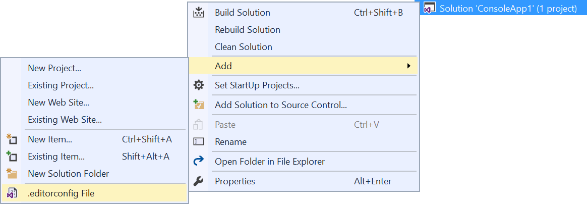
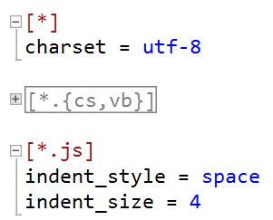
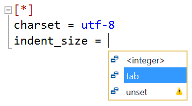

# EditorConfig

Download this extension from the [VS Marketplace](https://marketplace.visualstudio.com/items?itemName=MadsKristensen.EditorConfig)
or get the [CI build](http://vsixgallery.com/extension/1209461d-57f8-46a4-814a-dbe5fecef941/).

---------------------------------------

[The EditorConfig Project](http://editorconfig.org/) helps developers define and maintain
consistent coding styles between different editors and IDEs.

Visual Studio 2017 natively supports .editorconfig files, but it doesn't give
language support for editing those files. This extension provides that.

See the [change log](CHANGELOG.md) for changes and road map.

## Features

- Makes it easy to create .editorconfig files
- Syntax highlighting
- C# and .NET style analyzers
- Intellisense
- Validation
- Brace completion
- Brace matching
- Comment/uncomment
- Outlining (code folding)
- Drag 'n drop file onto .editorconfig file
- Code formatting
- Hover tooltips
- Navigational drop downs
- Inheritance visualizer

### Create .editorconfig files
To make it really easy to add a .editorconfig file, you can now right-click
any folder, project, solution folder and hit **Add -> .editorconfig File**

### Syntax highlighting
Full colorization of the full .editorconfig syntax.

### C# and .NET style analyzers
Visual Studio 2017 lets you add C# and .NET specific rules to the .editorconfig file. In addition to enabling various rules, a severity is also added to control how Visual Studio is going to handle these rules. 

Each severity is clearly marked by an icon to make it easy to identify.

### Intellisense
The extension provides Intellisense for both keywords and values.

  

### Validation
Red squiggles are shown for invalid values.

### Hover tooltips
Hover the mouse over any keyword to see a full description.

### Navigational drop downs
Dropdown menus at the top of the editor makes it easy to navigate the document.

### Inheritance visualizer
A project can have multiple .editorconfig files and the rules in each cascades
from the top-most and down. It is based on folder structure.

The inheritance visualizer is located at the bottom right corner of the editor window and makes it easy to see this relationship.

Note, the inheritance visualizer is only visible when the current file isn't the root of the hierarchys or by specifying the `root = true` property.

## Contribute
Check out the [contribution guidelines](.github/CONTRIBUTING.md)
if you want to contribute to this project.

For cloning and building this project yourself, make sure
to install the
[Extensibility Tools 2015](https://visualstudiogallery.msdn.microsoft.com/ab39a092-1343-46e2-b0f1-6a3f91155aa6)
extension for Visual Studio which enables some features
used by this project.

## License
[Apache 2.0](LICENSE)