# EditorConfig

Download this extension from the [VS Marketplace](https://marketplace.visualstudio.com/items?itemName=MadsKristensen.EditorConfig)
or get the [CI build](http://vsixgallery.com/extension/1209461d-57f8-46a4-814a-dbe5fecef941/).

---------------------------------------

[The EditorConfig Project](http://editorconfig.org/) helps developers define and maintain consistent coding styles between different editors and IDEs.

Visual Studio 2017 natively supports .editorconfig files, but it doesn't give language support for editing those files. This extension provides that

For Visual Studio version 2010 to 2015, get the [EditorConfig extension](https://marketplace.visualstudio.com/items?itemName=EditorConfigTeam.EditorConfig) instead.

See the [change log](CHANGELOG.md) for changes and road map.

Need help getting started with commands? Check out [Microsoft's Reference Guide](https://docs.microsoft.com/en-us/visualstudio/ide/editorconfig-code-style-settings-reference) for details and examples of coding styles available

## Features

- [Makes it easy to create .editorconfig files](#create_editorconfig_files)
- [Syntax highlighting](#syntax_highlighting)
- [C# and .NET style analyzers](#csharp_net_style_analyzers)
- [Intellisense](#intellisense)
- [Code snippets](#code_snippets)
- [Validation](#validation)
- [Hover tooltips](#hover_tooltips)
- [Light bulbs](#light_bulbs)
- [Code formatting](#code_formatting)
- [Navigational drop downs](#navigational_drop_downs)
- [Inheritance visualizer](#inheritance_visualizer)
- [Settings](#settings)
- Brace completion
- Brace matching
- Comment/uncomment
- Outlining (code folding)
- Drag 'n drop file onto .editorconfig file

### <a name="create_editorconfig_files">Create .editorconfig Files</a>
To make it really easy to add a .editorconfig file, you can now right-click
any folder, project, solution folder and hit **Add -> .editorconfig File**

### <a name="syntax_highlighting">Syntax Highlighting</a>
Full colorization of the full .editorconfig syntax.

### <a name="csharp_net_style_analyzers">C# and .NET Style Analyzers</a>
Visual Studio 2017 lets you add C# and .NET specific rules to the .editorconfig file. In addition to enabling various rules, a severity is also added to control how Visual Studio is going to handle these rules. 

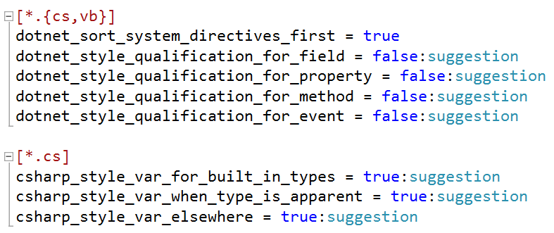

Each severity is clearly marked by an icon to make it easy to identify.

### <a name="intellisense">Intellisense</a>
The extension provides Intellisense for both keywords and values.

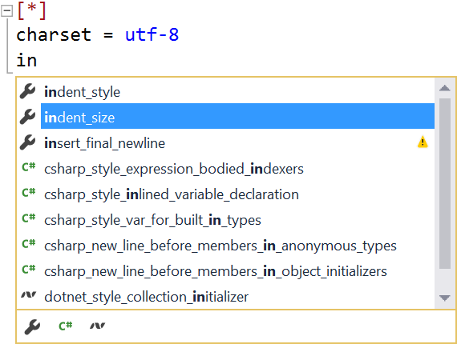  

### <a name="code_snippets">Code Snippets</a>
Various code snippets have been added to make it easier to work with .editorconfig files.

To insert a snippet, right-click inside the editor or hit *Ctrl+K,Ctrl+X*.

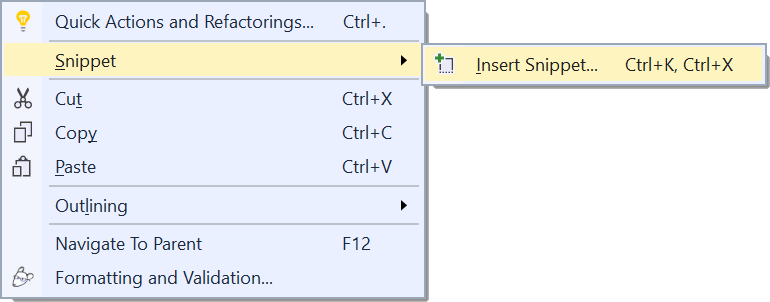

This will show a list of available snippets to insert.

### <a name="validation">Validation</a>
Error squiggles are shown for invalid values.

Properties that are being overridden by a duplicate property in the same section is easy to identify.

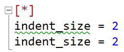

If a parent document contains the exact same property and value in a section with the same globbing pattern, a suggestion shows up to remove it.

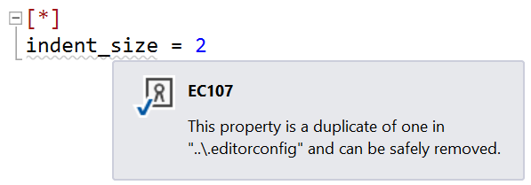

See the [complete list of error codes](https://github.com/madskristensen/EditorConfigLanguage/wiki/Error-codes).

To suppress any error in the .editorconfig document, use the light bulb feature:

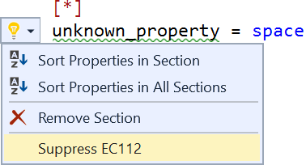

That will add a special comment at the top of the file to let the validator know what error messages to suppress.

Another way to suppress the error is by right-clicking the error in the Error List.

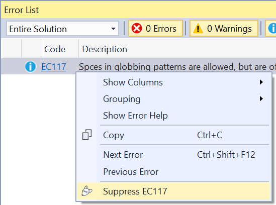

### <a name="hover_tooltips">Hover Tooltips</a>
Hover the mouse over any keyword to see a full description.

### <a name="light_bulbs">Light Bulbs</a>
Sorting properties and deleting sections is easy with the commands being shown as light bulbs in the editor margin.

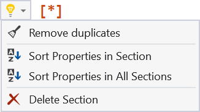

### <a name="code_formatting">Code Formatting</a>
Typing `Ctrl+K,D` will invoke Visual Studio's *Format Document* command. By default that will align all the equal (`=`) delimeters and add 1 space character around both equal- and colon characters. This behavior is configurable in the settings (see below).

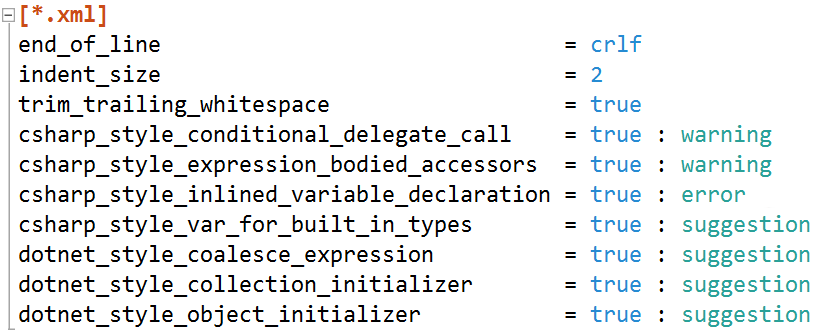

### <a name="navigational_drop_downs">Navigational Drop Downs</a>
Dropdown menus at the top of the editor makes it easy to navigate the document.

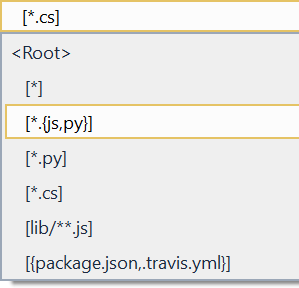

### <a name="inheritance_visualizer">Inheritance Visualizer</a>
A project can have multiple .editorconfig files and the rules in each cascades
from the top-most and down. It is based on folder structure.

The inheritance visualizer is located at the bottom right corner of the editor window and makes it easy to see this relationship.

You can navigate to the immediate parent document by hitting **F12**. You can change the shortcut under Tools -> Options -> Environment -> Keyboard and find the command called *EditorConfig.NavigateToParent*.

Note, the inheritance visualizer is only visible when the current file isn't the root of the hierarchys or by specifying the `root = true` property.

### <a name="settings">Settings</a>
Change the behavior of the editor from **Tools -> Options** or simply by right-clicking in the editor.

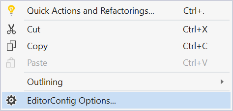

### <a name="contribute">Contribute</a>
Check out the [contribution guidelines](.github/CONTRIBUTING.md)
if you want to contribute to this project.

For cloning and building this project yourself, make sure
to install the
[Extensibility Tools 2015](https://visualstudiogallery.msdn.microsoft.com/ab39a092-1343-46e2-b0f1-6a3f91155aa6)
extension for Visual Studio which enables some features
used by this project.

References to available formatting/code options directly from Roslyn codebase
- [CSharp Portable Formatting Options](https://github.com/dotnet/roslyn/blob/master/src/Workspaces/CSharp/Portable/Formatting/CSharpFormattingOptions.cs)
- [CSharp Portable Code Style Options](https://github.com/dotnet/roslyn/blob/master/src/Workspaces/CSharp/Portable/CodeStyle/CSharpCodeStyleOptions.cs)
- [DotNet Portable Formatting Options](https://github.com/dotnet/roslyn/blob/master/src/Workspaces/Core/Portable/Formatting/FormattingOptions.cs)
- [DotNet Portable Code Style Options](https://github.com/dotnet/roslyn/blob/master/src/Workspaces/Core/Portable/CodeStyle/CodeStyleOptions.cs)

### <a name="license">License</a>
[Apache 2.0](LICENSE)